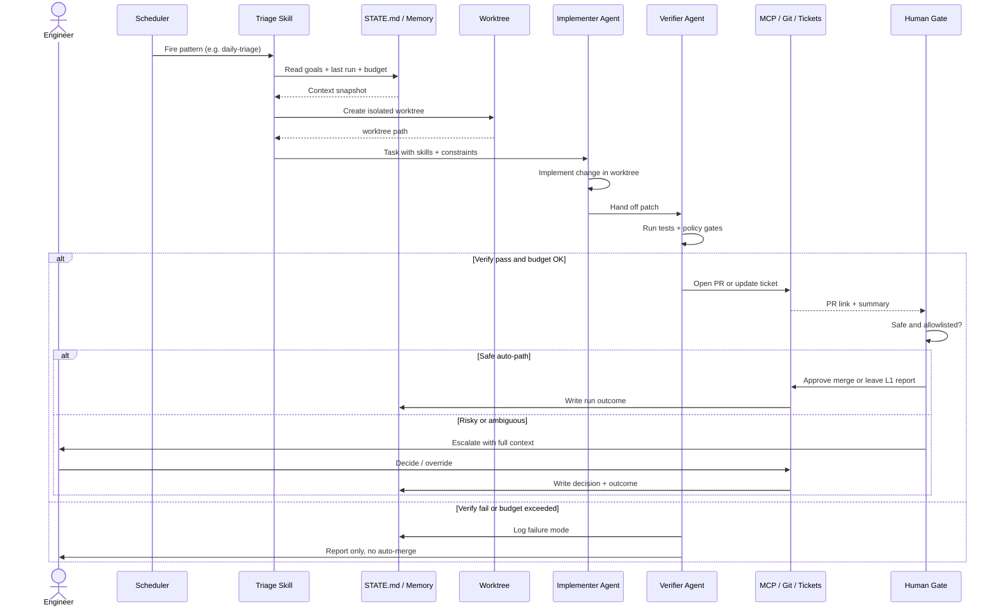
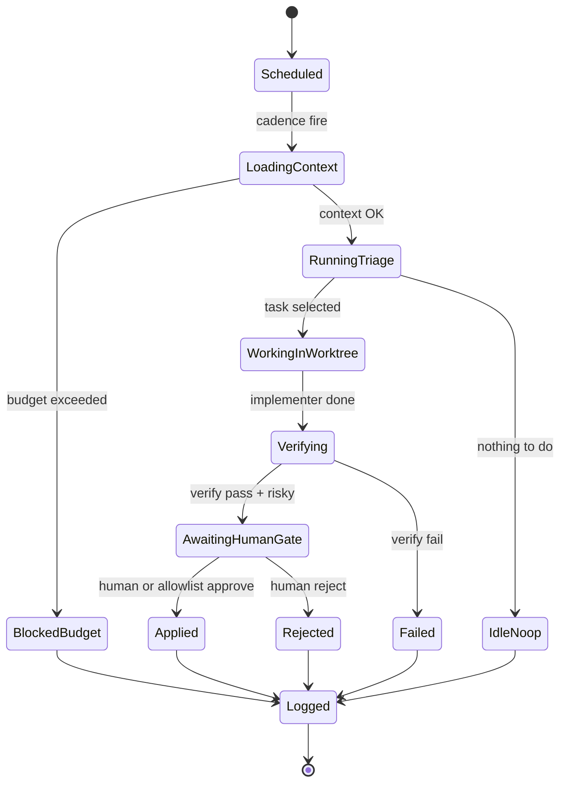
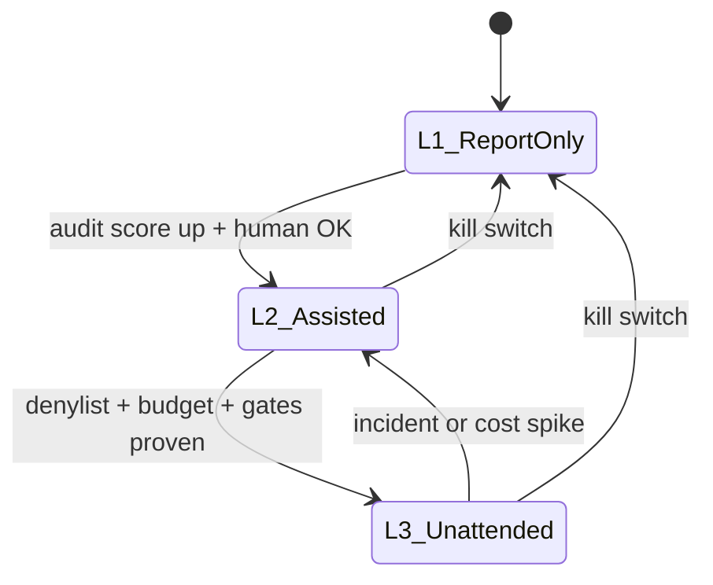
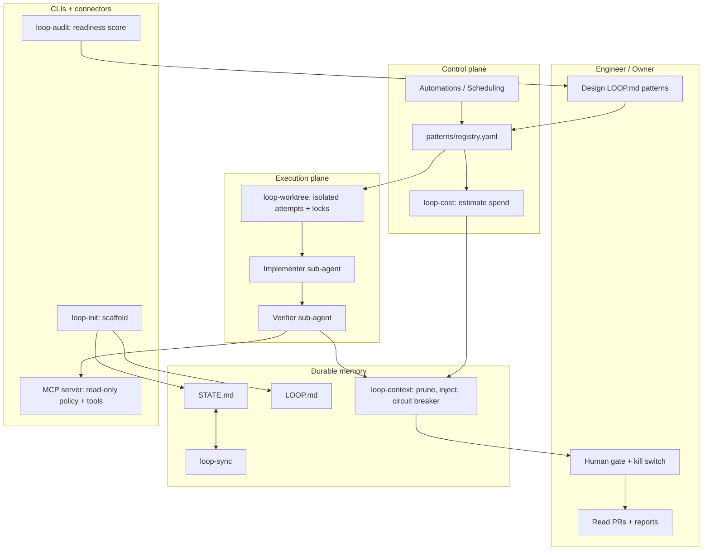

# Architecture Diagrams

Deeper, more detailed companions to the [Anatomy of a Loop](../README.md#anatomy-of-a-loop) diagram in the README. Where that one shows the linear shape of a single loop, these show: the actor-level sequence within one run, the states a run moves through, how the three autonomy levels relate, and how the actual tools in `tools/` map onto the [Five Building Blocks + Memory](primitives.md) model.

All diagrams are [Mermaid](https://mermaid.js.org/), rendered natively by GitHub when viewing this file.

## One loop cycle (sequence)

Who talks to whom, in order, within a single run — including the fork between the safe auto-path and the human escalation path.

## Run lifecycle (state)

The states one scheduled run moves through, from cadence fire to the final durable log entry.

## Autonomy levels L1-L3

How a pattern moves between report-only, assisted, and unattended operation — see [primitives-matrix.md](primitives-matrix.md) for the readiness criteria behind each transition.

## Stack: primitives + tools

The [Five Building Blocks + Memory](primitives.md) model made concrete: which package in `tools/` implements which primitive, and how they connect.

